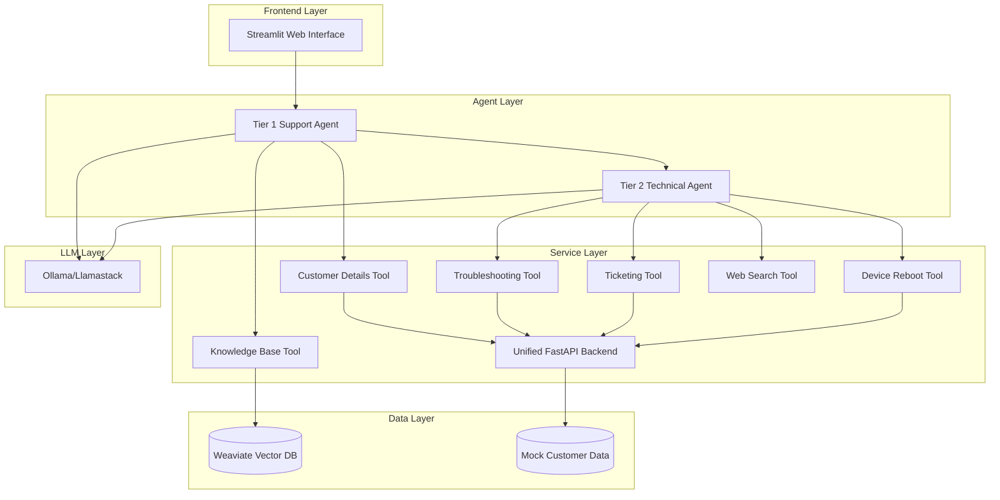

# 🤖 Agentic AI Support Demo

> **An intelligent IT support system powered by CrewAI agents, designed for enterprise deployment on OpenShift with Llamastack integration.**

[](https://opensource.org/licenses/MIT)
[](https://www.python.org/downloads/)
[](https://www.docker.com/)
[](https://www.redhat.com/en/technologies/cloud-computing/openshift)

---

## 🌟 Overview

This demo showcases the power of **agentic AI** for enterprise IT support scenarios. Built with CrewAI, it demonstrates how multiple AI agents can collaborate to resolve customer issues intelligently, leveraging various tools and knowledge sources.

### 🎯 Key Features

- **🤖 Multi-Agent Intelligence**: Tier 1 and Tier 2 support agents with specialized capabilities
- **🔍 Intelligent Knowledge Retrieval**: Vector-based FAQ search using Weaviate
- **🛠️ Comprehensive Tool Integration**: Customer data, troubleshooting guides, ticketing, and device management
- **🌐 Modern Web Interface**: Streamlit-powered user experience
- **☸️ Enterprise Ready**: Kubernetes/OpenShift deployment with scalability
- **🦙 LLM Flexibility**: Supports Ollama, Llamastack, and other LLM backends
- **📊 Production Monitoring**: Health checks, logging, and observability

---

## 🏗️ Architecture



---

## 🚀 Quick Start

### Prerequisites

- **Docker & Docker Compose** (20.10+)
- **8GB+ RAM** (recommended)
- **Python 3.11+** (for local development)
- **Git**

### One-Command Setup

```bash
git clone https://github.com/your-username/agentic-ai-support-demo.git
cd agentic-ai-support-demo
chmod +x setup.sh
./setup.sh
```

🌐 **Access the demo**: [http://localhost:8501](http://localhost:8501)

### Manual Setup

<details>
<summary>Click to expand manual setup instructions</summary>

```bash
# 1. Clone and navigate
git clone https://github.com/your-username/agentic-ai-support-demo.git
cd agentic-ai-support-demo

# 2. Start all services
docker-compose up -d

# 3. Wait for services to initialize
sleep 30

# 4. Pull the LLM model
docker exec ollama-llm ollama pull llama3

# 5. Initialize knowledge base
docker exec ai-support-demo python rag-setup/ingest_data.py

# 6. Verify setup
./scripts/test-services.sh
```

</details>

---

## 🎮 Demo Usage

### Sample Customer Interactions

Try these example queries to see the AI agents in action:

| **Scenario** | **Customer Query** | **Expected Behavior** |
|--------------|-------------------|----------------------|
| **Internet Issues** | *"I'm customer CUST123 and my internet is really slow today"* | Agent retrieves customer info, provides troubleshooting steps |
| **Login Problems** | *"Customer CUST789 here - I can't log into my account"* | Agent offers login troubleshooting and account verification |
| **Service Outage** | *"CUST456 - my internet is completely down"* | Agent checks service status, may initiate device reboot |
| **Billing Inquiry** | *"CUST000 - need help with a billing dispute"* | Agent retrieves account details and creates support ticket |

### Customer Test IDs

- **CUST123**: Alice Smith (Premium Internet, Active)
- **CUST456**: Bob Johnson (Basic Internet, Has Issues)
- **CUST789**: Charlie Brown (Standard TV, Login Issues)
- **CUST000**: Demo Customer (Fiber Max, Clean Account)

---

## 🔧 Development

### Project Structure

```
agentic-ai-support-demo/
├── 📱 app/                     # Core application logic
│   ├── agents.py               # CrewAI agent definitions
│   └── tools.py                # Custom agent tools
├── 🌐 api/                     # Unified FastAPI backend
│   ├── main.py                 # API service endpoints
│   └── Dockerfile              # API container
├── ⚙️ config/                  # Agent configurations
│   ├── agents.yaml             # Agent role definitions
│   └── tasks.yaml              # Task specifications
├── 🗄️ rag-setup/               # Knowledge base setup
│   ├── ingest_data.py          # Vector DB ingestion
│   └── data/product_faqs.json  # FAQ knowledge base
├── ☸️ k8s/                     # Kubernetes manifests
├── 📚 docs/                    # Documentation
├── 🔧 scripts/                 # Utility scripts
├── 🧪 tests/                   # Test suite
└── 💡 examples/                # Demo scenarios
```

### Local Development Setup

```bash
# Create virtual environment
python -m venv .venv
source .venv/bin/activate  # On Windows: .venv\Scripts\activate

# Install dependencies
pip install -r requirements.txt

# Run individual components for development
python main.py                    # Streamlit app
python api/main.py                # API service
python rag-setup/ingest_data.py   # Knowledge base setup
```

### Testing

```bash
# Run complete test suite
python -m pytest tests/ -v

# Run specific test categories
python -m pytest tests/test_api.py -v          # API tests
python -m pytest tests/test_agents.py -v       # Agent tests
python -m pytest tests/test_integration.py -v  # Integration tests

# Test individual components
python test_agents.py              # Agent functionality
./scripts/test-services.sh         # Service health checks
```

---

## 🚢 Deployment

### Docker Compose (Local/Development)

```bash
# Start all services
docker-compose up -d

# View logs
docker-compose logs -f

# Stop and cleanup
docker-compose down -v
```

### OpenShift/Kubernetes (Production)

<details>
<summary>Click to expand OpenShift deployment instructions</summary>

#### Prerequisites
- OpenShift cluster access
- `oc` CLI tool configured
- Container registry access

#### Build and Push Images

```bash
# Build API image
docker build -t your-registry/support-api:latest ./api/
docker push your-registry/support-api:latest

# Build main application image
docker build -t your-registry/ai-support-app:latest .
docker push your-registry/ai-support-app:latest
```

#### Deploy to OpenShift

```bash
# Method 1: Use deployment script
./scripts/deploy.sh

# Method 2: Manual deployment
oc apply -f k8s/namespace.yaml
oc apply -f k8s/
```

#### Verify Deployment

```bash
# Check pod status
oc get pods -n agentic-ai-demo

# Check routes
oc get routes -n agentic-ai-demo

# View logs
oc logs -f deployment/ai-support-app -n agentic-ai-demo
```

</details>

### Llamastack Integration

To integrate with Llamastack instead of Ollama:

1. Update `litellm.config.json`:
```json
{
  "model_alias_map": {
    "demo-llm": {
      "model_name": "your-llamastack-model",
      "provider": "llamastack",
      "api_base": "http://llamastack-service:8080",
      "api_key": "your-api-key"
    }
  }
}
```

2. Update environment variables in OpenShift deployment:
```yaml
env:
- name: LLAMASTACK_ENDPOINT
  value: "http://llamastack-service:8080"
```

---

## 📊 Monitoring & Observability

### Health Checks

| **Service** | **Endpoint** | **Purpose** |
|-------------|--------------|-------------|
| API Health | `GET /health` | Service status |
| Weaviate | `GET /v1/meta` | Vector DB status |
| Ollama | `GET /api/tags` | LLM availability |
| Streamlit | `GET /` | Frontend status |

### Logging

```bash
# View all service logs
docker-compose logs -f

# View specific service logs
docker logs ai-support-demo        # Main app
docker logs support-api            # API service
docker logs weaviate               # Vector database
docker logs ollama-llm             # LLM service
```

### Performance Monitoring

The demo includes built-in performance monitoring:
- Response time tracking
- Token usage metrics
- Agent decision logging
- Tool utilization statistics

---

## 🔧 Configuration

### Environment Variables

| **Variable** | **Description** | **Default** |
|--------------|-----------------|-------------|
| `LITELLM_CONFIG_PATH` | LiteLLM configuration file | `/app/litellm.config.json` |
| `WEAVIATE_URL` | Weaviate database URL | `http://weaviate:8080` |
| `API_BASE_URL` | Support API base URL | `http://api-services:8000` |
| `TAVILY_API_KEY` | Web search API key | None (optional) |

### Customization

<details>
<summary>Click to expand customization options</summary>

#### Adding New Customer Data

Edit `api/main.py` and update the `MOCK_CUSTOMERS` dictionary:

```python
MOCK_CUSTOMERS["CUST999"] = {
    "account_id": "CUST999",
    "name": "New Customer",
    "service_status": "Active",
    "plan": "Enterprise",
    "current_issues": []
}
```

#### Adding New FAQ Content

Edit `rag-setup/data/product_faqs.json`:

```json
{
  "id": "faq_new_issue_01",
  "title": "New Issue Title",
  "content": "Detailed solution content...",
  "category": "new_category"
}
```

Then re-run: `docker exec ai-support-demo python rag-setup/ingest_data.py`

#### Creating Custom Tools

Add new tools in `app/tools.py`:

```python
class CustomTool(BaseTool):
    name: str = "Custom Tool"
    description: str = "Description of what this tool does"
    
    def _run(self, input_param: str) -> str:
        # Your custom logic here
        return "Tool result"
```

</details>

---

## 🧪 API Reference

### Core Endpoints

<details>
<summary>Click to expand API documentation</summary>

#### Customer Management

```http
GET /account_status/{account_id}
```
Retrieves customer account information and current issues.

**Response:**
```json
{
  "account_id": "CUST123",
  "name": "Alice Smith",
  "service_status": "Active",
  "plan": "Premium Internet",
  "current_issues": []
}
```

#### Troubleshooting

```http
GET /troubleshooting_steps/{issue_type}
```
Gets step-by-step troubleshooting guide for common issues.

**Response:**
```json
{
  "issue": "Internet Slow",
  "steps": [
    "1. Restart your router and modem...",
    "2. Check bandwidth usage...",
    "3. Run speed test..."
  ]
}
```

#### Ticketing

```http
POST /create_ticket
```
Creates a new support ticket.

**Request:**
```json
{
  "customer_id": "CUST123",
  "issue_summary": "Internet connectivity issues",
  "priority": "Medium"
}
```

#### Device Management

```http
POST /reboot_device/{device_id}
```
Initiates remote device reboot.

**Response:**
```json
{
  "status": "success",
  "message": "Remote reboot command sent to device DEV123."
}
```

</details>

### Interactive API Documentation

When running locally, access the interactive API docs at:
- **Swagger UI**: [http://localhost:8000/docs](http://localhost:8000/docs)
- **ReDoc**: [http://localhost:8000/redoc](http://localhost:8000/redoc)

---

## 🛠️ Troubleshooting

### Common Issues

<details>
<summary>🔴 Services won't start</summary>

**Symptoms:** Containers exit immediately or fail health checks

**Solutions:**
```bash
# Check Docker resources (needs 8GB+ RAM)
docker system df
docker system prune

# Verify port availability
netstat -tulpn | grep -E "(8000|8001|8501|8081|11434)"

# Check logs for specific errors
docker-compose logs [service-name]
```

</details>

<details>
<summary>🔴 LLM model loading fails</summary>

**Symptoms:** Ollama service healthy but model not available

**Solutions:**
```bash
# Pull model manually
docker exec ollama-llm ollama pull llama3

# Check available models
docker exec ollama-llm ollama list

# Verify model is working
docker exec ollama-llm ollama run llama3 "Hello"
```

</details>

<details>
<summary>🔴 Knowledge base is empty</summary>

**Symptoms:** Agents can't find FAQ information

**Solutions:**
```bash
# Re-run data ingestion
docker exec ai-support-demo python rag-setup/ingest_data.py

# Check Weaviate status
curl http://localhost:8081/v1/meta

# Verify data exists
curl http://localhost:8081/v1/objects | jq '.objects | length'
```

</details>

<details>
<summary>🔴 Agents provide generic responses</summary>

**Symptoms:** AI doesn't use tools or provides unhelpful responses

**Solutions:**
```bash
# Verify API services are running
curl http://localhost:8000/health

# Check LiteLLM configuration
cat litellm.config.json

# Test agent tools individually
python -c "from app.tools import CustomerDetailsTool; print(CustomerDetailsTool()._run('CUST123'))"
```

</details>

### Debug Commands

```bash
# Health check all services
./scripts/test-services.sh

# View all logs in real-time
docker-compose logs -f

# Reset entire environment
./scripts/reset-demo.sh

# Check resource usage
docker stats

# Test API endpoints manually
curl -X GET http://localhost:8000/account_status/CUST123
curl -X POST http://localhost:8000/create_ticket \
  -H "Content-Type: application/json" \
  -d '{"customer_id":"CUST123","issue_summary":"Test issue"}'
```

---

## 🤝 Contributing

We welcome contributions! Please see our [contribution guidelines](CONTRIBUTING.md) for details.

### Development Workflow

1. **Fork** the repository
2. **Create** a feature branch: `git checkout -b feature/amazing-feature`
3. **Make** your changes and add tests
4. **Test** your changes: `python -m pytest tests/ -v`
5. **Commit** your changes: `git commit -m 'Add amazing feature'`
6. **Push** to the branch: `git push origin feature/amazing-feature`
7. **Submit** a pull request

### Code Style

- Follow [PEP 8](https://pep8.org/) for Python code
- Use [Black](https://black.readthedocs.io/) for code formatting
- Add docstrings to all functions and classes
- Include tests for new functionality

---

## 📚 Documentation

- **[Setup Guide](docs/setup-guide.md)** - Detailed installation instructions
- **[OpenShift Deployment](docs/openshift-deployment.md)** - Production deployment guide
- **[Llamastack Integration](docs/llamastack-integration.md)** - LLM backend integration
- **[API Reference](docs/api-reference.md)** - Complete API documentation
- **[Troubleshooting](docs/troubleshooting.md)** - Common issues and solutions

---

## 🔗 Related Projects

- **[CrewAI](https://github.com/joaomdmoura/crewai)** - Multi-agent framework
- **[Weaviate](https://github.com/weaviate/weaviate)** - Vector database
- **[LiteLLM](https://github.com/BerriAI/litellm)** - LLM integration layer
- **[Streamlit](https://github.com/streamlit/streamlit)** - Web app framework

---

## 📄 License

This project is licensed under the MIT License - see the [LICENSE](LICENSE) file for details.

---

## 🙏 Acknowledgments

- **CrewAI Team** for the excellent multi-agent framework
- **Weaviate** for the powerful vector database
- **OpenShift** for the enterprise Kubernetes platform
- **Streamlit** for the intuitive web interface framework

---

## 📞 Support

- **Issues**: [GitHub Issues](https://github.com/your-username/agentic-ai-support-demo/issues)
- **Discussions**: [GitHub Discussions](https://github.com/your-username/agentic-ai-support-demo/discussions)
- **Documentation**: [Wiki](https://github.com/your-username/agentic-ai-support-demo/wiki)

---

<div align="center">

**⭐ Star this repo if you find it helpful!**

[🚀 Get Started](#-quick-start) • [📖 Documentation](#-documentation) • [🤝 Contribute](#-contributing)

</div>